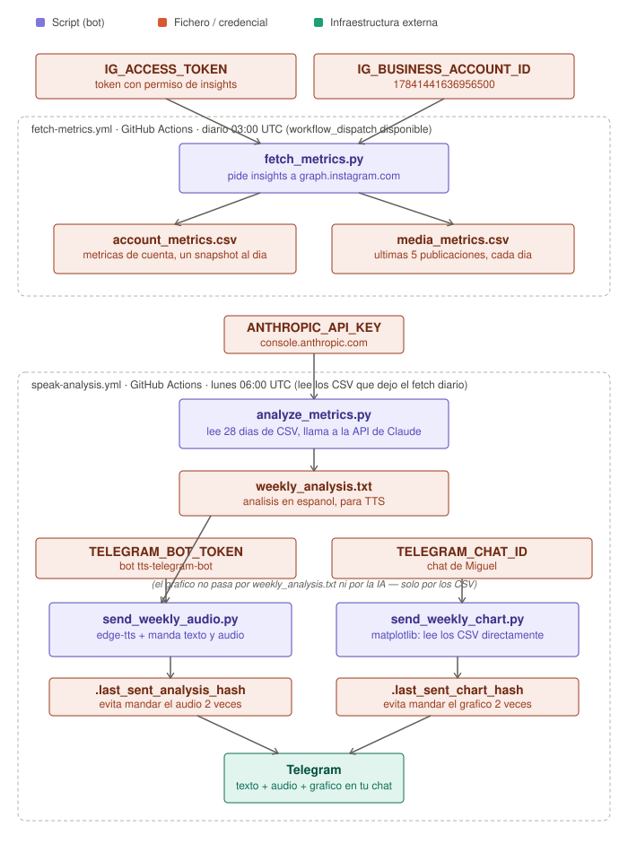

# Bot de metricas de Instagram

## Objetivo

Cada semana, pide a la Graph API de Instagram las metricas de tu cuenta
(alcance, visitas al perfil, interacciones...) y de tus publicaciones
recientes (alcance, likes, comentarios, guardados...), y las guarda en dos
CSV dentro de este mismo repo. Con ese historico, Claude (o cualquier otra
herramienta) puede leer la evolucion en el tiempo y darte analisis y consejos
sin tener que llamar a la API cada vez que preguntes.

Es un proyecto independiente del bot de publicacion (`automatizacion-instagram`)
a proposito, aunque los dos hablan con la misma cuenta de Instagram — asi cada
uno tiene su propio repo, su propio cron y sus propios secrets, y un fallo en
uno no afecta al otro.

## Esquema



## Arquitectura

**Entorno:** GitHub Actions (gratuito, sin mantenimiento, no depende de que
tengas el ordenador encendido) — igual que el bot de publicacion.

**Frecuencia:** cron semanal, lunes 07:00 UTC (`.github/workflows/fetch-metrics.yml`).
Puedes cambiar el cron o lanzarlo a mano desde la pestana Actions de GitHub
(`workflow_dispatch`).

**Datos guardados:**
- `account_metrics.csv` — una fila por metrica de cuenta y ejecucion (alcance,
  visitas al perfil, cuentas alcanzadas, interacciones totales, clics a la
  web, seguidores).
- `media_metrics.csv` — una fila por metrica y publicacion de los ultimos 90
  dias (alcance, reproducciones, likes, comentarios, veces compartida,
  guardados, interacciones totales). Como se vuelve a pedir cada semana para
  las mismas publicaciones, puedes ver como evoluciona un post con el tiempo,
  no solo su valor final.

Ambos CSV son de solo-anadir (append-only), igual que `published_log.csv` del
otro bot, y tienen `merge=union` en `.gitattributes` para que nunca haya
conflictos de git si se ejecuta mas de una vez seguida.

## Estado

- `fetch_metrics.py` — validado contra la API real desde el 2026-08-04 (21
  publicaciones, metricas de cuenta y de posts llegando bien, incluidos
  seguidores reales via `fetch_account_fields()` — la metrica de insights
  `follower_count` no daba datos ni con `metric_type=total_value`, asi que
  seguidores/num. de publicaciones se piden directo al perfil en vez de a
  `/insights`).
- `send_weekly_audio.py` / `speak-analysis.yml` — probado de punta a punta el
  2026-08-04 con un analisis escrito a mano: genero el audio y llego bien por
  Telegram.
- `analyze_metrics.py` — probado con la API simulada (mocks), pendiente de
  probar contra la API real de Anthropic — falta que se ejecute una vez en
  GitHub Actions con `ANTHROPIC_API_KEY` configurada (ver mas abajo).

**Nota sobre una vuelta atras:** la primera version de esto usaba una tarea
programada de Cowork para que Claude escribiera el analisis. Se descarto:
esas tareas solo corren si tienes la app de Cowork abierta en ese momento, y
si no, se posponen a cuando la abras — eso rompia la idea de que todo el
bot funcione sin depender de tu ordenador. Ahora el analisis lo pide
directamente `analyze_metrics.py` a la API de Claude, dentro del mismo run
de GitHub Actions — sin Cowork de por medio para nada del flujo semanal.

## Puesta en marcha (pasos que tienes que hacer tu)

### 1. Crear el repositorio en GitHub

Esta carpeta ya tiene `git init` hecho localmente. Crea un repositorio vacio
en GitHub (puede ser privado) y anade el remoto:

```
git remote add origin <URL-de-tu-repo>
git branch -M main
git push -u origin main
```

### 2. Dar permiso de insights al token

El token que ya usas para publicar (en `token facebook app.txt`, carpeta
`BOTS`) se genero solo con permiso de publicar. Para leer metricas hace falta
ademas:

- `instagram_business_basic`
- `instagram_business_manage_insights`

Ve a tu app en [developers.facebook.com](https://developers.facebook.com/),
revisa los permisos concedidos al token de tu cuenta de Instagram y anade
esos dos si no los tiene, o genera un token nuevo que ya los incluya. Puedes
usar el mismo token para los dos bots (publicar y metricas) o uno distinto
para cada uno — como prefieras.

### 3. Configurar los Secrets del repo

En GitHub: **Settings → Secrets and variables → Actions → New repository
secret**. Anade:

- `IG_ACCESS_TOKEN`
- `IG_BUSINESS_ACCOUNT_ID` (el mismo ID que usas en el otro bot: `17841441636956500`)

### 4. Primera ejecucion manual

Pestana **Actions** del repo → **Recoger metricas de Instagram (programado)**
→ **Run workflow**. Revisa el log como se explica arriba.

## Analisis semanal por audio (Telegram)

Ademas de guardar los datos, cada semana se analizan de verdad (llamando a la
API de Claude, no una plantilla de numeros fija) y el resultado te llega como
audio a tu bot de Telegram de texto-a-voz (`tts-telegram-bot`). Todo el flujo
vive en GitHub Actions — no depende de que tengas Cowork ni el ordenador
encendidos:

1. **`fetch-metrics.yml`** (lunes 07:00 UTC) corre dos scripts seguidos, en el
   mismo run:
   - `fetch_metrics.py` — actualiza `account_metrics.csv` y `media_metrics.csv`,
     como antes.
   - `analyze_metrics.py` — le pasa esos CSV a la API de Claude (Messages API)
     y guarda la respuesta en `weekly_analysis.txt`. Si este paso falla (p.ej.
     la API de Anthropic caida), no bloquea el commit de los CSV — se marca
     como fallido en el log, pero los datos se guardan igual.
   - Al final se comitean juntos `account_metrics.csv`, `media_metrics.csv` y
     `weekly_analysis.txt`.
2. **`speak-analysis.yml`** (lunes 10:00 UTC, tres horas de margen) — lee
   `weekly_analysis.txt`, genera el audio con `edge-tts` (la misma libreria
   que usa `tts-telegram-bot`) y lo manda por Telegram. Solo manda audio si el
   texto cambio desde el ultimo envio (compara un hash guardado en
   `.last_sent_analysis_hash`), asi que ejecutarlo dos veces seguidas no te
   duplica el mensaje.

Por que en dos workflows y no uno: son responsabilidades distintas (recoger
datos + analizar vs. convertir a voz + avisar), y separarlos permite que uno
falle sin tumbar al otro, ademas de dejar margen de tiempo entre los dos sin
complicar el cron.

### Secrets nuevos para este paso

Ademas de `IG_ACCESS_TOKEN` e `IG_BUSINESS_ACCOUNT_ID`, anade en
**Settings → Secrets and variables → Actions**:

- `ANTHROPIC_API_KEY` — creala en [console.anthropic.com](https://console.anthropic.com/settings/keys).
  Coste: una llamada semanal a un par de CSV pequeños, del orden de centimos
  al mes con el modelo por defecto (`claude-sonnet-5` — cambialo con la
  variable `ANTHROPIC_MODEL` en el workflow si prefieres uno mas barato).
- `TELEGRAM_BOT_TOKEN` — el token de tu bot `tts-telegram-bot` (el mismo que
  tienes en `BOTS/tts-telegram-bot/.env`).
- `TELEGRAM_CHAT_ID` — tu chat_id de Telegram.

**Aviso de seguridad:** ese mismo token de Telegram esta ahora mismo escrito
en texto plano en `BOTS/tts-telegram-bot/.env`. No pasa nada mientras esa
carpeta no sea un repo de git publico (ya se quito la copia que habia
tambien en su README).

## ¿Y si quiero pedirte un analisis fuera de la rutina semanal?

Puedo leer `account_metrics.csv` y `media_metrics.csv` cuando quieras, en
cualquier conversacion normal con Claude, y darte un analisis al momento —
no hace falta esperar al lunes ni tocar la API por separado.

## Sobre el token de GitHub que le diste a Claude

Ese *fine-grained PAT* (solo este repo, permiso `Contents: Read and write`)
ya no hace falta para el flujo semanal — con el rediseño de arriba, todo lo
recurrente corre dentro de GitHub Actions usando su propio token integrado,
sin que Claude necesite tocar el repo entre semana. Sigue siendo util para
que Claude pueda hacer cambios puntuales (como los de hoy) sin pedirte que
copies y pegues comandos de git constantemente, asi que puedes dejarlo activo
si te viene bien — o revocarlo desde GitHub cuando quieras, no rompe nada de
lo automatico.

## Estructura del repo

```
instagram-metrics-bot/
├── scripts/
│   ├── fetch_metrics.py         # Pide insights y los anade a los CSV
│   ├── analyze_metrics.py       # Le pasa los CSV a la API de Claude y escribe weekly_analysis.txt
│   └── send_weekly_audio.py     # Convierte weekly_analysis.txt a audio y lo manda
├── .github/workflows/
│   ├── fetch-metrics.yml        # Cron semanal: actualiza los CSV Y el analisis (mismo run)
│   └── speak-analysis.yml       # Cron semanal: manda el audio si hay analisis nuevo
├── docs/
│   └── esquema-bot.svg          # Diagrama del flujo completo (ver "Esquema" arriba)
├── account_metrics.csv          # Se crea solo en la primera ejecucion
├── media_metrics.csv            # Se crea solo en la primera ejecucion
├── weekly_analysis.txt          # Lo escribe analyze_metrics.py cada semana
├── .last_sent_analysis_hash     # Lo escribe speak-analysis.yml, evita duplicados
├── requirements.txt
├── .env.example
├── .gitattributes
└── .gitignore
```
